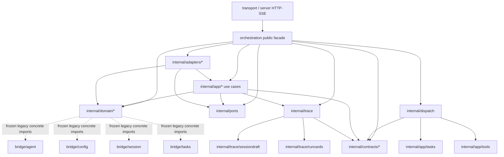

# Orchestration Stage 0 Dependency Graph

更新时间：2026-06-06

## 冻结范围

阶段 0 只冻结边界，不迁移业务代码。以下公开契约保持不变：

- `core/shared/schema/defs/*` 的跨进程 payload 契约。
- `orchestration.Service` 公开 facade、公开类型 alias 与兼容入口。
- `orchestration/internal/contracts/bus` 的 action/status 常量。
- HTTP/SSE 与 bus 链路中的 `trace_id` 传播语义。

## 当前量化基线

| 项 | 当前值 | 阶段 0 处理 |
| --- | ---: | --- |
| `core/bridge/orchestration` Go 文件总数 | 257 | 记录基线 |
| 顶层 `orchestration` Go 文件 | 61 | 白名单冻结，禁止新增顶层 Go 文件 |
| `internal/app/workflows` Go 文件 | 21 | 记录为后续拆分压力点 |
| `internal/app/orchestrations` Go 文件 | 19 | 记录为后续拆分压力点 |
| `internal/domain` Go 文件 | 47 | 记录 domain concrete import 冻结范围 |
| `core/bridge/tasks` 类型文件 | 5 个 / 345 行 | 记录当前工作区类型拆分现状，不在阶段 0 继续拆分 |

## 结构与依赖压力

- 顶层 `orchestration`：当前 61 个 Go 文件已经卡在 M2.1 预算上限；阶段 0 只冻结新增顶层文件，既有 façade、alias、兼容入口与未下沉业务桥接暂不迁移。
- `70 -> 61` 差异来源：当前工作区已删除/下沉顶层 `plan_mode.go`、`service_action_router.go`、`service_config_providers.go`、`service_tools.go`、`session_contract.go`、`session_title.go`、`task_run_transcript.go`、`task_runtime_overrides.go`、`tool_lists_shim.go`。
- `internal/app/*`：用例层仍直接接入 concrete 包，压力集中在 `workflows` 21 个文件与 `orchestrations` 19 个文件；本阶段仅记录，不增加 app 层 import 禁令。
- `internal/domain/*`：`workflow` 15 个文件、`sessionturn` 14 个文件；当前 concrete import 债务集中在 `task/sessionturn` 对 `tasks/agent/config/session` 的依赖，未发现 `tools` 依赖。
- `core/bridge/tasks`：当前工作区已有 `types.go`、`types_task.go`、`types_run.go`、`types_runtime.go`、`types_load.go` 五个类型文件；阶段 0 只记录依赖与验收用途，不继续移动类型。

## 直接依赖图

## First-party Import Matrix

| Package | Direct first-party imports |
| --- | --- |
| `orchestration` | `agent`, `config`, `llm`, `mode`, `runtime`, `session`, `skills`, `streaming`, `taskdefs`, `tasks`, `tools`, `internal/adapters/*`, `internal/app/*`, `internal/contracts/*`, `internal/dispatch`, `internal/domain/*`, `internal/ports`, `internal/shared/text`, `internal/trace*` |
| `internal/dispatch` | `internal/app/tasks`, `internal/app/tools`, `internal/contracts/api`, `internal/contracts/bus` |
| `internal/app/agentturn` | `agent`, `config`, `llm`, `streaming`, `tasks`, `internal/contracts/*`, `internal/trace` |
| `internal/app/workflows` | `llm`, `tasks`, `tools`, `internal/domain/workflow`, `internal/shared/*` |
| `internal/app/orchestrations` | `tasks`, `internal/domain/group`, `internal/ports`, `internal/shared/*` |
| `internal/app/{config,prompts,skills,tasks,tools}` | `config`, `llm`, `skills`, `tasks`, `tools`, `internal/contracts/*` |
| `internal/adapters/agent` | `tasks`, `tools`, `internal/adapters/toolregistry`, `internal/app/*`, `internal/domain/group`, `internal/ports` |
| `internal/adapters/toolregistry` | `tools`, `internal/domain/group` |
| `internal/ports` | `agent`, `config`, `llm`, `session`, `streaming`, `tasks`, `tools`, `internal/domain/group` |
| `internal/trace` | `agent`, `session`, `streaming`, `tasks`, `internal/contracts/api`, `internal/trace/sessiondraft` |
| `internal/trace/runcards` | `streaming`, `tasks`, `internal/contracts/api`, `internal/trace` |
| `internal/trace/sessiondraft` | `session`, `streaming` |
| `internal/contracts/api` | `taskdefs`, `tasks` |
| `internal/contracts/toolschema` | `llm` |
| `internal/domain/sessionturn` | `agent`, `config`, `llm`, `session`, `internal/contracts/api` |
| `internal/domain/task` | `agent`, `llm`, `tasks` |
| `internal/domain/workflow` | `taskdefs` |
| `internal/domain/group` | `taskdefs` |

## 冻结守卫

- `core/bridge/orchestration/internal/structure_guard_test.go`
  - `TestOrchestrationTopLevelFileAllowlist`：冻结当前顶层 61 个 Go 文件，新增顶层文件必须迁入目标层或显式修改白名单。
  - `TestDomainConcreteImportFreeze`：冻结 domain 层当前 concrete import 债务，禁止新增 `agent/config/session/tasks/tools` 具体包依赖。
  - `TestDomainConcreteImportFreezeBaselineIsExact`：要求 domain concrete import 白名单与当前实际债务精确匹配，迁走依赖后必须删除对应白名单项。
- `scripts/check-layers.sh`
  - 保留现有 apps/driver 与 transport/orchestration 粗粒度禁令。
  - 追加运行上述阶段 0 守卫，使用 `-timeout 60s`。

## 当前已知债务

- `internal/domain/*` 仍存在既有 concrete imports：`agent`、`config`、`session`、`tasks`。阶段 0 已冻结；`group/workflow` 已改走 `taskdefs`，后续迁移需要继续通过 domain contract 或 ports 消除剩余债务。
- 顶层 `orchestration` 仍直接编排大量 app/domain/trace/adapters 包，目标态应继续收敛为 facade、alias 与兼容入口。
- `internal/ports` 当前接口仍暴露多个 concrete bridge 类型，后续 ports/contracts 需要继续瘦身。
