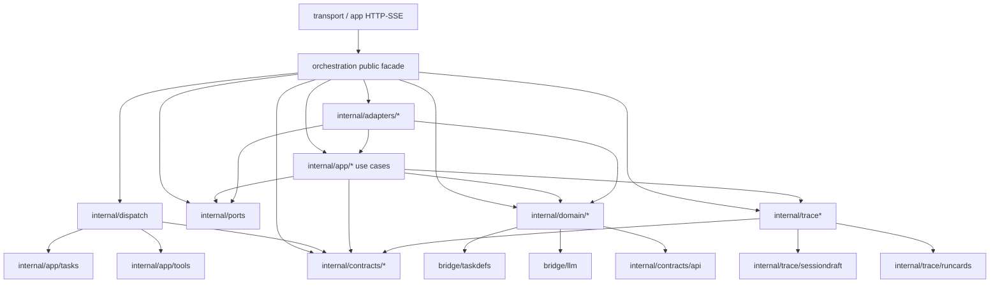

# Orchestration Stage 0 Dependency Baseline

更新时间：2026-06-06

## 冻结范围

阶段 0 只冻结边界，不迁移业务代码。以下公开契约保持不变：

- `core/shared/schema/*` 的跨进程 payload 契约。
- `orchestration.Service` 公开 façade、公开类型 alias 与兼容入口。
- `orchestration/internal/contracts/bus` 的 action/status 常量。
- HTTP/SSE 与 bus 链路中的 `trace_id` 传播语义。

## 结构基线

| 项 | 当前值 |
| --- | ---: |
| `core/bridge/orchestration` Go 文件总数 | 287 |
| 顶层 `core/bridge/orchestration` Go 文件 | 29 |
| `internal/app/workflows` 顶层 Go 文件 | 15 |
| `internal/app/orchestrations` 顶层 Go 文件 | 15 |
| `internal/domain` Go 文件 | 51 |
| `core/bridge/tasks/types.go` 行数 | 3 |

## 直接依赖图

## First-party Import Baseline

以下依赖清单由 `cd core/bridge && go list -f '{{.ImportPath}} {{join .Imports " "}}' ./orchestration/...`
盘点后归并，只列 first-party 直接依赖。

| Package group | Direct first-party imports |
| --- | --- |
| `orchestration` | `agent`, `config`, `llm`, `runtime`, `session`, `skills`, `streaming`, `taskdefs`, `tasks`, `tools`, `internal/adapters/*`, `internal/app/*`, `internal/contracts/*`, `internal/dispatch`, `internal/domain/{group,workflow}`, `internal/ports`, `internal/trace` |
| `internal/dispatch` | `internal/app/{tasks,tools}`, `internal/contracts/{api,bus}` |
| `internal/app/agentturn*` | `agent`, `config`, `llm`, `mode`, `runtime`, `session`, `streaming`, `taskdefs`, `tasks`, `tools`, `internal/app/{sessions,tasks}`, `internal/contracts/{api,bus}`, `internal/domain/{runtimeopts,sessionturn}`, `internal/shared/text`, `internal/trace*` |
| `internal/app/workflows*` | `llm`, `streaming`, `taskdefs`, `tasks`, `tools`, `internal/domain/workflow`, `internal/shared/{result,text}`, `internal/trace/runcards` |
| `internal/app/orchestrations*` | `agent`, `config`, `llm`, `runtime`, `session`, `streaming`, `taskdefs`, `tasks`, `tools`, `internal/adapters/toolregistry`, `internal/app/{agentturn,tasks}`, `internal/domain/{group,runtimeopts}`, `internal/ports`, `internal/shared/{result,text}` |
| `internal/app/{config,prompts,skills,tasks,tools}` | `agent`, `config`, `llm`, `session`, `skills`, `streaming`, `taskdefs`, `tasks`, `tools`, `internal/app/workflows`, `internal/contracts/*`, `internal/domain/*`, `internal/shared/text`, `internal/trace/runcards` |
| `internal/adapters/*` | `agent`, `config`, `llm`, `runtime`, `session`, `streaming`, `taskdefs`, `tasks`, `tools`, `internal/app/*`, `internal/contracts/api`, `internal/contracts/bus`, `internal/domain/*`, `internal/ports`, `internal/trace*` |
| `internal/contracts/api` | `taskdefs`, `tasks` |
| `internal/contracts/toolschema` | `llm` |
| `internal/ports` | `agent`, `config`, `llm`, `session`, `streaming`, `tasks`, `tools`, `internal/domain/group` |
| `internal/shared/result` | `tasks` |
| `internal/trace*` | `agent`, `session`, `streaming`, `tasks`, `tools`, `internal/contracts/api`, `internal/trace/sessiondraft` |

## Domain Import Baseline

`orchestration/internal/domain/*` 当前 first-party 直接依赖如下：

| Domain package | Direct first-party imports |
| --- | --- |
| `internal/domain/group` | `taskdefs` |
| `internal/domain/runtimeopts` | `taskdefs` |
| `internal/domain/sessionturn` | `llm`, `internal/contracts/api` |
| `internal/domain/task` | `llm`, `taskdefs` |
| `internal/domain/workflow` | `taskdefs` |

当前 domain concrete import 债务为 0；`agent`、`config`、`session`、`tasks`、`tools` 均禁止直接引入。
该守卫由 `core/bridge/orchestration/internal/structure_guard_test.go` 实现，并通过
`bash scripts/check-layers.sh` 在仓库根目录执行。

## 已知风险

- 顶层 `orchestration` 当前 29 个 Go 文件已满足 M3 <=30，但仍未达到最终 <=15。
- `internal/app/workflows` 与 `internal/app/orchestrations` 均正好为 15，后续新增文件必须先拆分子域。
- `internal/ports` 与 app/adapters 层仍暴露或接入多个 concrete bridge 类型；阶段 0 只冻结 domain 与顶层回流，不扩大禁令。
